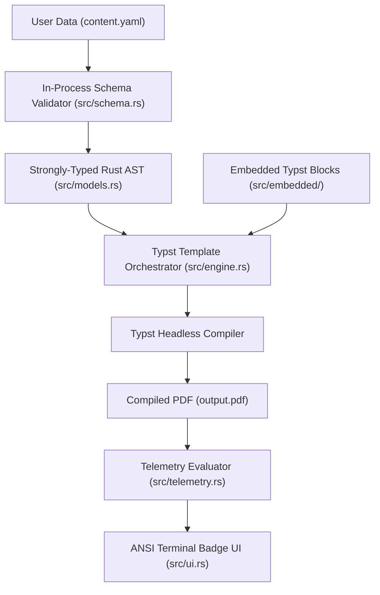

# Resumake Architecture & Pipeline Design

[← Documentation Hub](README.md) • [Getting Started](getting-started.md) • [Schema Reference](schema-guide.md) • [Layout Telemetry](telemetry-guide.md) • **Architecture** • [Contributing](contributing.md)

---

This document outlines the internal architecture, module separation, and execution lifecycle of the **Resumake** engine.

---

## 1. High-Level Architecture Diagram

---

## 2. Module Responsibilities

| Module | Source File | Purpose |
| :--- | :--- | :--- |
| **`models`** | [`src/models.rs`](../src/models.rs) | Serde data models, JSON Schema generation (`schemars`), and default value derivations. |
| **`schema`** | [`src/schema.rs`](../src/schema.rs) | In-process schema validation, JSON Schema export, and scaffolding generators. |
| **`engine`** | [`src/engine.rs`](../src/engine.rs) | Template resolution, embedded asset extraction, and Typst compiler process orchestration. |
| **`telemetry`**| [`src/telemetry.rs`](../src/telemetry.rs) | PDF page counting, vertical fill ratio estimation, and line wrap heuristics. |
| **`ui`** | [`src/ui.rs`](../src/ui.rs) | Zero-dependency terminal formatting, ANSI boxed badges, and error diagnostics. |
| **`cli`** | [`src/cli.rs`](../src/cli.rs) | Clap command parsing, dispatching, and file-watching event loops. |

---

## 3. Execution Lifecycle (`resumake build`)

1. **Step 1: Schema Ingestion & Validation**
   * Reads `content.yaml`.
   * Validates YAML structure in-memory using `jsonschema` against the embedded canonical schema.
   * If validation fails, outputs exact line-number error diagnostics and halts before invoking any compiler.

2. **Step 2: Embedded Template Synthesis**
   * Extracts embedded Typst template modules (`main.typ`, `tokens.typ`, and `blocks/*.typ`) into a clean cache/temporary directory if not already cached.
   * Injects parsed `content.yaml` into the Typst rendering context.

3. **Step 3: Headless Compilation**
   * Spawns the Typst compiler engine to render the vector PDF in under 100ms.

4. **Step 4: Layout Telemetry Evaluation**
   * Inspects the output PDF byte stream to determine physical dimensions, page count, and vertical balance.
   * Renders the boxed telemetry summary to the terminal.

---

## 4. Key Design Decisions

* **Embedded Assets (`rust-embed`):** All Typst template files, modular block definitions, and default schemas are embedded directly into the binary at compile time. The user only needs a single binary executable.
* **In-Process Validation:** Catching schema errors in Rust memory eliminates cryptic compiler tracebacks when invalid YAML properties are supplied.
* **Zero Decorative Dependencies:** Avoids heavy UI frameworks or emoji bloat in favor of fast, clean ANSI terminal boxes.
