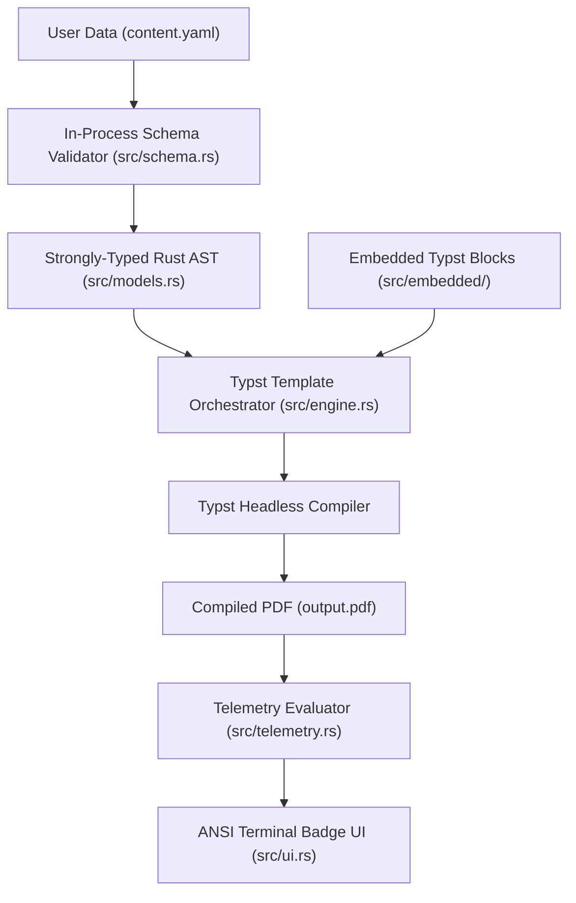

# Resumake Architecture & Pipeline Design

[← Documentation Hub](README.md) • [Getting Started](getting-started.md) •
[Schema Reference](schema-guide.md) • [Layout Telemetry](telemetry-guide.md) •
**Architecture** • [Contributing](contributing.md)

---

This document outlines the internal architecture, module separation, and
execution lifecycle of the **Resumake** engine.

---

## 1. High-Level Architecture Diagram

---

## 2. Module Responsibilities

| Module          | Source File                               | Purpose                                                                                                            |
| :-------------- | :---------------------------------------- | :----------------------------------------------------------------------------------------------------------------- |
| **`models`**    | [`src/models.rs`](../src/models.rs)       | Serde data models, JSON Schema generation (`schemars`), and default value derivations.                             |
| **`schema`**    | [`src/schema.rs`](../src/schema.rs)       | In-process schema validation, JSON Schema export, and scaffolding generators.                                      |
| **`engine`**    | [`src/engine.rs`](../src/engine.rs)       | Named template registry, template resolution, embedded asset extraction, and Typst compiler process orchestration. |
| **`telemetry`** | [`src/telemetry.rs`](../src/telemetry.rs) | Queries `<pageinfo>`/`<bulletinfo>` metadata and evaluates fill ratio and wrap heuristics.                         |
| **`ui`**        | [`src/ui.rs`](../src/ui.rs)               | Zero-dependency terminal formatting, ANSI boxed badges, and error diagnostics.                                     |
| **`cli`**       | [`src/cli.rs`](../src/cli.rs)             | Clap command parsing, dispatching, and file-watching event loops.                                                  |

---

## 3. Execution Lifecycle (`resumake build`)

1. **Schema Ingestion & Validation** — reads and checks `content.yaml`:
   - Reads `content.yaml`.
   - Validates YAML structure in-memory using `jsonschema` against the embedded
     canonical schema.
   - If validation fails, outputs exact line-number error diagnostics and halts
     before invoking any compiler.

2. **Embedded Template Synthesis** — prepares the Typst inputs:
   - Extracts embedded Typst template modules (`main.typ`, `tokens.typ`, and
     `blocks/*.typ`) into a clean cache directory if not already cached.
   - Injects parsed `content.yaml` into the Typst rendering context.

3. **Headless Compilation** — renders the PDF:
   - Spawns the Typst compiler engine to render the vector PDF in under 100ms.

4. **Layout Telemetry Evaluation** — measures the result:
   - Queries `<pageinfo>` and `<bulletinfo>` metadata directly from the compiled
     document via `typst query` to determine page count, vertical fill, and
     per-bullet wrap status.
   - Renders the boxed telemetry summary to the terminal.

---

## 4. Key Design Decisions

- **Embedded Assets:** All Typst template files, modular block definitions, and
  default schemas are embedded directly into the binary at compile time via
  `include_str!`. The user only needs a single binary executable.
- **Template Registry:** Embedded templates live under
  `src/embedded/templates/<name>/` (currently just `classic`) and are registered
  in `src/engine.rs`'s `TEMPLATE_REGISTRY`. `--template <name>` picks a registry
  entry; `resolve_template` extracts it into `.resumake/<name>/` so multiple
  named layouts (e.g. a future two-column `sidebar` template) can be added
  without touching `models.rs` or the content schema — every template renders
  the same `ResumeDocument` data, it's free to lay the sections out however it
  wants. The one contract a new template must honor is emitting the `<pageinfo>`
  metadata tag (and routing bullet-like content through the `guard()` primitive
  for `<bulletinfo>`) so layout telemetry keeps working. `--source` remains a
  separate escape hatch for pointing at an arbitrary `.typ` file outside the
  registry entirely.
- **In-Process Validation:** Catching schema errors in Rust memory eliminates
  cryptic compiler tracebacks when invalid YAML properties are supplied.
- **Zero Decorative Dependencies:** Avoids heavy UI frameworks or emoji bloat in
  favor of fast, clean ANSI terminal boxes.
